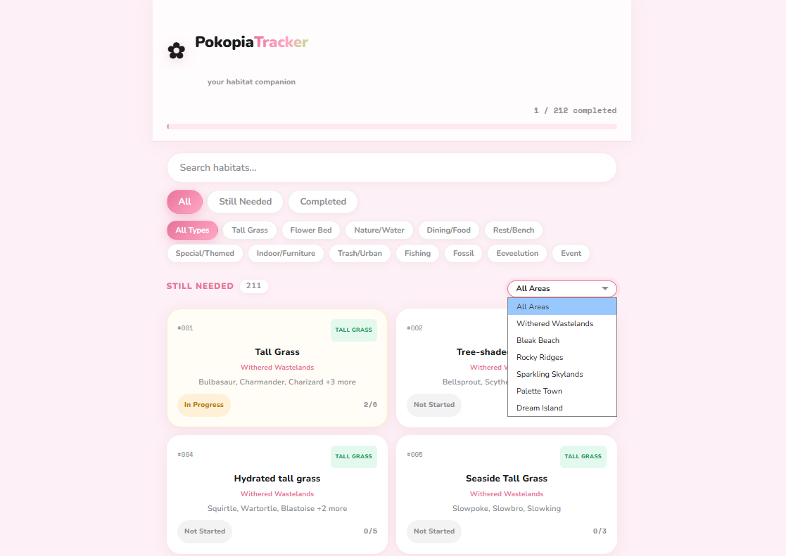
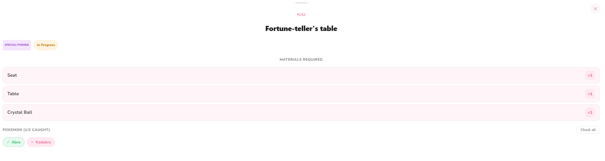

# Pokopia Tracker

A personal habitat tracker for Pokopia. Track which of the 212 habitats you've built (includes the 4 event habitats),  check off caught Pokemon per habitat, and filter by region, category, or status.

Built as a personal tool to track progress in Pokopia =)

**[Live Demo →](https://pokopia-tracker-tau.vercel.app)**





## Features
- 212 habitats with materials and Pokemon data (across all regions)
- Per-Pokemon checkboxes within the individual habitat cards
- Filter by region, category, or search by name
- Progress persists via localStorage; no account needed

## Tech Stack
React 19 · Vite · Pure CSS

## Getting Started

```bash
npm install
npm run dev
```

Then open [http://localhost:5173](http://localhost:5173).

## Scripts

| Command | Description |
|---|---|
| `npm run dev` | Start dev server |
| `npm run build` | Build for production |
| `npm run preview` | Preview production build |
| `npm run lint` | Run ESLint |

