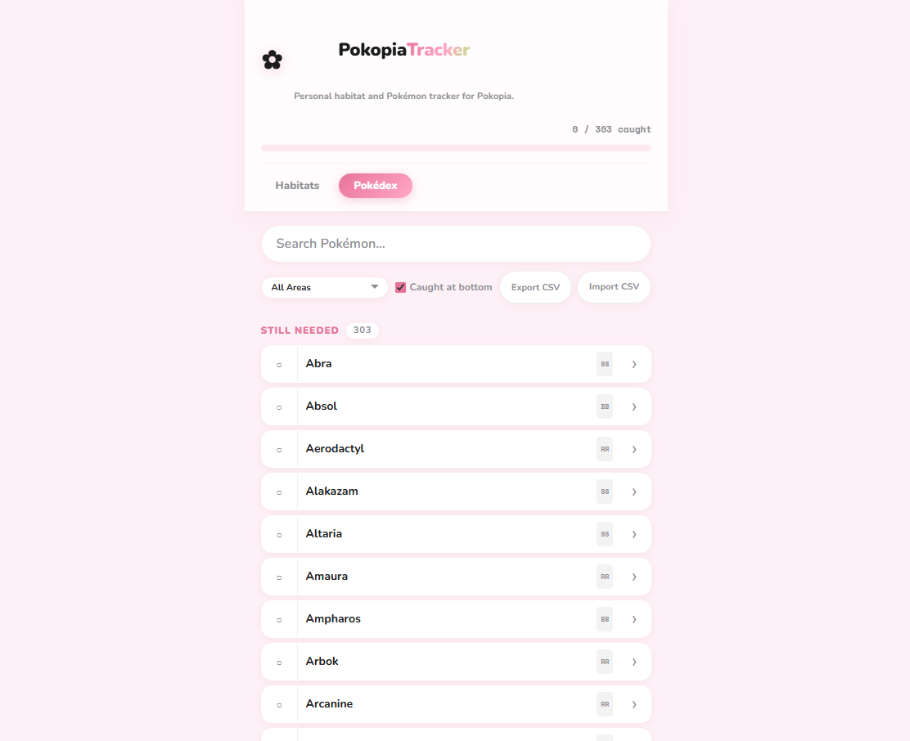
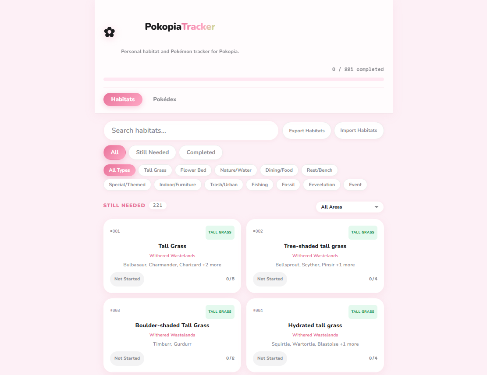

# Pokopia Tracker

A lightweight habitat and pokemon tracker for Pokopia built to track personal progress. It's deployed on Vercel using localStorage, so no account is needed.

**[Live Demo →](https://pokopia-tracker-tau.vercel.app)**

## Features

There are other community trackers out there that are way more comprehensive, this one is intentionally personal and focused on what I actually needed while playing.

- **Habitats view**: Habitats organized into Still Needed / Completed sections, with filters for region, category (tall grass, flower bed, fishing spot, etc.), and name search. Click any card to check off individual Pokémon, mark all at once, or track partial progress.
- **Pokédex view**: Pokémon checklist with caught/uncaught tracking, region tags, and a toggle to view a unified alphabetical list instead of split sections. Filters for area (I used this page the most while playing, a nice view to just have on the phone).
- **CSV backup**: export and import your Pokédex progress or full habitat progress as CSVs. Because if you clear your history, it all goes goodbye! If you reset the data it automatically exports your progress first (because I got sad and forgot)
- **No account, no server**: everything lives in localStorage. I deployed it on Vercel so I could easily have it as a web app on my phone.

## Data / Current State
- 221 habitats (209 unique + 9 Palette Town stubs + 3 events)
- 303 Pokémon (includes Pokopia-exclusive Pokémon and counted-separately variant forms)

Habitat and Pokémon data was compiled from Serebii and community resources. The Pokémon list is treated as the source of truth; habitats are categorized and assigned to a region (Withered Wastelands, Bleak Beach, Rocky Ridges, Sparkling Skylands, Palette Town, Dream Island) based on where they were first catalogued. **Region assignments are approximate**, most habitats probably appear across all regions in-game, but the data here reflects where the habitat was sourced from rather than an exhaustive location list. Pokopia is still a relatively new game so the data may have gaps, PRs welcome if you spot something wrong. This was made entirely for fun when the game came out, so there's probably a good number of inaccuracies / gaps but I found it useful - and it's cute!

## Tech Stack
React 19, Vite, Pure CSS

## Running Locally

```bash
npm install
npm run dev
```

Then open [http://localhost:5173](http://localhost:5173).

## Preview
### Pokedex View


### Habitat View
